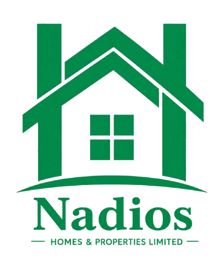

# MASTER BUILD PROMPT — NADIOS HOMES & PROPERTIES LIMITED WEBSITE

---

## YOUR ROLE

You are a senior full-stack web developer and UI/UX designer. Your task is to build the complete, production-ready website for **Nadios Homes & Properties Limited** — a Nigerian residential property development company based in Lagos. You will build this as a **multi-page HTML/CSS/Vanilla JS website**.

A context file (`nadios-website-context.md`) has been uploaded with all content, brand specs, file structure, and feature requirements. Read it in full before writing a single line of code.

---

## DESIGN REFERENCE & AESTHETIC

Study and replicate the **design language, layout patterns, and UI aesthetic** of [https://www.hollybrook.co.uk/](https://www.hollybrook.co.uk/) — a premium UK property developer website. Your build must match and *exceed* it in quality.

### Key Hollybrook UI Patterns to Replicate Precisely:
- **Full-screen video hero** with a dark overlay, minimal white text, and subtle animated text reveal on load
- **Sticky navigation** — transparent on load, transitions to white with shadow on scroll; logo left, nav links centre, CTA button right
- **"About strip" below hero** — dark/green horizontal band with a brief company intro paragraph and an inline text CTA arrow link
- **4-tile "Core Teams" / services grid** — square image tiles with text overlaid at the bottom, hover reveals a slightly lighter overlay + text shift; tiles are full-width across the viewport in a 2×2 or 4-column row
- **"Featured Projects" section** — alternating full-width + half-width tile layout: one large tile spanning the full width, then two half-width tiles side by side, then one full-width again. Tiles are images with project name and location overlaid bottom-left. On hover, the image zooms slightly and the text lifts
- **Stats / numbers strip** — full-width dark green band with large white numerals and labels (e.g. "10+ Years")
- **Footer** — dark green background, 4-column layout, logo top-left, social icons, legal links bottom row
- **Inner page hero banners** — full-width image with 50% dark overlay, page title centred in white
- **Clean, generous whitespace** — 120px section padding desktop, sections alternate white and `#F8FAF9`

### Improvements Beyond Hollybrook (Creative Additions):
1. **Floating WhatsApp Chat Button** — fixed bottom-right, pulsing green animation, opens `https://wa.me/234XXXXXXXXXX`
2. **Investment ROI Calculator page** — interactive JS calculator in Nigerian Naira (₦), with sliders for property price, deposit %, loan tenure, expected rental yield, and appreciation rate; live-updating results card
3. **Project Status Filter Tabs** — on the Projects page, JS-powered filter: All | Completed | Ongoing | Upcoming
4. **Scroll-triggered fade-in animations** — IntersectionObserver on all section entries for elegant reveal
5. **Project Detail page template** — hero image, specs table, feature list, 6-image gallery grid, enquiry form
6. **Cookie consent banner** — minimal, brand-coloured
7. **Back-to-top button** — appears after 300px scroll, smooth scroll
8. **Active nav link highlighting** — JS detects current page filename
9. **Masonry-style gallery** page with category filter tabs and lightbox
10. **Mobile-first hamburger nav** — full-screen overlay with staggered link animation

---

## BRAND SPECIFICATIONS

| Property | Value |
|---|---|
| Primary Green | `#028B4A` |
| Dark Green (hover) | `#016A38` |
| Light Green (tint) | `#E8F5EE` |
| Off-White (section bg) | `#F8FAF9` |
| Deep Charcoal (headings) | `#1A1A1A` |
| Mid Grey (body text) | `#4A4A4A` |
| Display Font | `Playfair Display` — 700, 900 (Google Fonts) |
| Body Font | `DM Sans` — 300, 400, 500, 700 (Google Fonts) |
| Logo | `assets/images/logo.png` |
| Border Radius | `4px` (subtle, not pill-shaped) |

---

## PAGES TO BUILD (10 pages)

Build all 10 pages as separate `.html` files sharing one `assets/css/style.css` and one `assets/js/main.js`:

1. `index.html` — Home
2. `about.html` — About Us
3. `services.html` — Services
4. `projects.html` — Projects / Properties
5. `project-detail.html` — Single Project Template
6. `gallery.html` — Gallery
7. `faqs.html` — FAQs
8. `contact.html` — Contact
9. `calculator.html` — Investment ROI Calculator *(Creative Add-On)*
10. `privacy.html` — Privacy Policy (minimal page)

---

## IMAGE & VIDEO PLACEHOLDERS

**CRITICAL:** Do NOT use broken `` tags. All images must be styled placeholder `<div>` elements:

```html
<!-- Image placeholder pattern -->
<div class="img-placeholder" style="aspect-ratio: 16/9;">
  <span>IMAGE: Hero — Aerial view of Lagos residential development</span>
</div>

<!-- Video placeholder pattern -->
<div class="video-placeholder">
  <span>VIDEO: Drone footage of Nadios development — hero background</span>
  <p>Upload: assets/video/hero-video.mp4</p>
</div>
```

CSS for placeholders:
```css
.img-placeholder {
  background: #E8F5EE;
  border: 2px dashed #028B4A;
  display: flex;
  flex-direction: column;
  align-items: center;
  justify-content: center;
  color: #028B4A;
  font-family: 'DM Sans', sans-serif;
  font-size: 0.85rem;
  font-weight: 500;
  text-align: center;
  padding: 1.5rem;
  width: 100%;
  height: 100%;
  min-height: 200px;
}
.video-placeholder {
  background: #1A1A1A;
  border: 2px dashed #028B4A;
  display: flex;
  flex-direction: column;
  align-items: center;
  justify-content: center;
  color: #028B4A;
  font-family: 'DM Sans', sans-serif;
  font-size: 0.9rem;
  text-align: center;
  padding: 2rem;
  width: 100%;
  height: 100%;
}
```

When the actual image *is* loaded (via `` tag), use `loading="lazy"` on all images.

---

## DETAILED PAGE SPECIFICATIONS

### PAGE 1: `index.html` — Home

**Section 1 — Hero (full-screen video)**
- Full-screen `<section>` with `min-height: 100vh`
- Video placeholder div filling the full section
- Dark overlay: `background: rgba(0,0,0,0.55)`
- Centred white text:
  - Small uppercase label: `NADIOS HOMES & PROPERTIES LIMITED`
  - H1: `Building Quality Homes.` (new line) `Creating Lasting Value.`
  - Subtext paragraph
  - Two CTA buttons: Primary `Explore Our Projects` + Secondary `Contact Us`
- Animated scroll-down arrow at bottom centre
- Text reveals with CSS `@keyframes` on load (fade up staggered)

**Section 2 — About Strip**
- Full-width dark green `#028B4A` band
- Single paragraph intro left-aligned in a container + arrow link right: `More About Nadios →`

**Section 3 — Core Services Grid**
- Heading: `What We Do`
- 4-column image tile grid (2×2 on tablet, 4 on desktop)
- Each tile: image placeholder (square) + text overlay bottom + category label
- Hover: image scales 1.04, overlay darkens, text lifts 4px
- Services: Property Development | Construction Services | Property Management | Investment Advisory

**Section 4 — Featured Projects**
- Heading: `Featured Developments`
- Hollybrook-style alternating layout:
  - Row 1: One full-width tile
  - Row 2: Two half-width tiles side by side
  - Row 3: One full-width tile
- Each tile: image placeholder + bottom-left text overlay (project name + location tag)
- Hover: image zoom + text lift
- CTA below: `Explore All Projects →`

**Section 5 — Stats Bar**
- Full-width green `#028B4A` strip
- 4 stats in a row: `10+` Years Experience | `50+` Homes Delivered | `₦B+` in Development Value | `100%` Client Commitment

**Section 6 — Why Choose Us**
- Off-white `#F8FAF9` background
- Heading: `Why Choose Nadios`
- 3-column (desktop) / 2-col (tablet) / 1-col (mobile) icon+text cards
- 6 cards: 10+ Years Experience | Quality Construction | Professional PM | Customer-Focused | Reliable Delivery | Long-Term Value

**Section 7 — Testimonials**
- White background
- Heading: `What Our Clients Say`
- JS carousel / slider with 3 testimonial cards
- Each card: large quote mark, quote text, client name, property
- Dots navigation

**Section 8 — CTA Banner**
- Full-width green band
- Heading: `Ready to Find Your Dream Home?`
- Sub: `Speak with our team today about available properties and investment opportunities.`
- Button: `Get In Touch`

---

### PAGE 2: `about.html` — About Us

- **Hero banner:** full-width image placeholder, dark overlay, "About Nadios" title centred
- **Our Story section:** white bg, heading left, large body text right (split layout)
- **Mission / Vision / Values:** 3-column card layout (white cards, green accent top border)
- **3 Values Cards** (like Hollybrook's 3-column values): Integrity & Accountability | Excellence & Innovation | Partnership & Long-Term Thinking
- **Team image placeholder** — large half-width image with caption
- **Core Services 4-tile grid** (same as homepage)

---

### PAGE 3: `services.html` — Services

- **Hero banner:** image placeholder + "Our Services" title
- **Services intro paragraph**
- **6 service cards** in a 3-column (desktop) / 2-col (tablet) grid:
  - Each card: icon (Lucide or SVG), title, description, `Learn More →` link
  - Hover: card lifts, left border turns green
- **Process section:** numbered steps (1→2→3→4) in a horizontal flow: Consultation → Planning → Construction → Delivery
- **CTA strip:** green band — "Ready to start your project? Contact our team."

---

### PAGE 4: `projects.html` — Projects

- **Hero banner:** "Our Developments"
- **Filter tabs bar:** All | Completed | Ongoing | Upcoming (JS filter using `data-status` attributes)
- **Project grid:** alternating full-width + half-width tiles (Hollybrook portfolio layout)
  - 5 placeholder projects (see context file)
  - Each tile: image placeholder + overlay bottom-left (name, location, status badge)
  - Status badge colours: Completed = green, Ongoing = amber `#D97706`, Upcoming = blue `#2563EB`
  - Click → links to `project-detail.html`

---

### PAGE 5: `project-detail.html` — Single Project

- **Full-width hero image placeholder**
- **Project info bar:** Name | Location | Status | Type
- **Description:** 2-column split (image left, text right)
- **Features grid:** icons + specs (Bedrooms, Bathrooms, Size, Finish Level, Year)
- **Gallery grid:** 2×3 image placeholders with lightbox
- **Enquiry form:** Name, Phone, Email, Message, Submit
- **Back to Projects link**

---

### PAGE 6: `gallery.html` — Gallery

- **Hero banner:** "Gallery"
- **Filter tabs:** All | Exteriors | Interiors | Construction | Sites
- **Masonry/grid layout:** 3-column (desktop), 2-col (tablet), 1-col (mobile)
- 12 image placeholder tiles with `data-category` attributes for JS filtering
- **Lightbox:** click image → fullscreen overlay with prev/next navigation
- Lightbox: escape key closes, arrow keys navigate

---

### PAGE 7: `faqs.html` — FAQs

- **Hero banner:** "Frequently Asked Questions"
- **Accordion layout:** 7 FAQ items (see context file for Q&As)
- JS accordion: click question → answer slides open, chevron rotates
- Only one open at a time
- **CTA strip at bottom:** "Have a different question? Get in touch."

---

### PAGE 8: `contact.html` — Contact

- **Hero banner:** "Get In Touch"
- **Split layout:** left panel = contact info, right panel = form
- **Left panel:** office address, phone (placeholder), email (placeholder), WhatsApp CTA button, Google Maps embed placeholder
- **Right panel — Contact form:**
  - Full Name (text)
  - Phone Number (tel)
  - Email Address (email)
  - Subject (select dropdown: General Enquiry / Buy a Property / Investment Partnership / Project Management / Other)
  - Message (textarea, 5 rows)
  - Submit button: `Send Message`
- **Form validation:** JS validates all fields before submit, shows success/error state
- **No backend required** — on submit show a success message: *"Thank you. We'll be in touch within 24 hours."*

---

### PAGE 9: `calculator.html` — Investment ROI Calculator *(Creative Add-On)*

- **Hero banner:** "Property Investment Calculator" — subtitle: *"Estimate your potential returns on a Nadios property investment."*
- **Split layout — white bg:**
  - **Left: Inputs Panel**
    - Property Price (₦) — range input slider + number display: ₦5,000,000 → ₦500,000,000
    - Initial Deposit (%) — slider 10% → 50%
    - Loan Tenure — radio buttons or select: 5 / 10 / 15 / 20 years
    - Expected Annual Rental Yield (%) — slider 4% → 20%, default 8%
    - Annual Capital Appreciation (%) — slider 5% → 20%, default 12%
  - **Right: Results Card** (dark green `#028B4A` background, white text)
    - Live updates on every input change
    - Displays:
      - Estimated Monthly Rental Income (₦)
      - Estimated Annual Rental Income (₦)
      - Loan Amount (₦)
      - Estimated 5-Year Capital Gain (₦)
      - Projected Property Value in 5 Years (₦)
      - Total ROI at 5 Years (%)
    - Animated number counter on value change
    - Disclaimer text at bottom
- **CTA below:** "Interested in investing? Talk to our team." → Contact button

---

### PAGE 10: `privacy.html` — Privacy Policy

- Simple page with privacy policy text (generic template, client to update)

---

## NAVIGATION

```html
<!-- Desktop nav structure -->
<nav class="navbar" id="navbar">
  <div class="nav-container">
    <a href="index.html" class="nav-logo">
      
    </a>
    <ul class="nav-links">
      <li><a href="index.html">Home</a></li>
      <li><a href="about.html">About Us</a></li>
      <li><a href="services.html">Services</a></li>
      <li><a href="projects.html">Projects</a></li>
      <li><a href="gallery.html">Gallery</a></li>
      <li><a href="faqs.html">FAQs</a></li>
    </ul>
    <div class="nav-actions">
      <a href="calculator.html" class="nav-calc-link">ROI Calculator</a>
      <a href="contact.html" class="btn btn-primary">Contact Us</a>
    </div>
    <button class="hamburger" id="hamburger" aria-label="Open menu">
      <span></span><span></span><span></span>
    </button>
  </div>
</nav>

<!-- Mobile overlay nav -->
<div class="mobile-nav" id="mobileNav">
  <button class="mobile-nav-close" id="mobileNavClose">✕</button>
  <!-- all links with staggered animation -->
</div>
```

**Navbar JS behaviour:**
- On page load: `navbar` has class `nav-transparent` (no background, white links)
- On scroll > 80px: removes `nav-transparent`, adds `nav-scrolled` (white bg, dark links, shadow)
- Hamburger: toggles `mobile-nav` open/close with overlay
- Active page: add class `active` to current page link via JS (match `window.location.pathname`)

---

## FOOTER

```html
<footer class="footer">
  <div class="footer-main">
    <div class="footer-col footer-brand">
      <!-- Logo (white/light version) -->
      <!-- Company description -->
      <!-- Social icons -->
    </div>
    <div class="footer-col">
      <h4>Quick Links</h4>
      <!-- nav links -->
    </div>
    <div class="footer-col">
      <h4>Services</h4>
      <!-- services list -->
    </div>
    <div class="footer-col">
      <h4>Contact</h4>
      <!-- address, email, phone -->
      <!-- WhatsApp button -->
    </div>
  </div>
  <div class="footer-bottom">
    <p>© 2025 Nadios Homes & Properties Limited. All Rights Reserved.</p>
    <div class="footer-legal">
      <a href="privacy.html">Privacy Policy</a>
      <a href="faqs.html">FAQs</a>
    </div>
  </div>
</footer>
```

---

## GLOBAL COMPONENTS (in `main.js`)

```javascript
// 1. Navbar scroll behaviour
// 2. Mobile hamburger menu
// 3. Active nav link detection
// 4. Scroll-triggered fade-in (IntersectionObserver)
// 5. Back-to-top button
// 6. Cookie consent banner (show on first visit, store in localStorage)
// 7. Smooth scroll
// 8. Number counter animation (for stats section)
// 9. FAQ accordion
// 10. Gallery filter tabs + lightbox
// 11. Project filter tabs
// 12. Testimonials carousel/slider
// 13. Investment calculator live computation
// 14. Contact form validation + submission handler
```

---

## CSS ARCHITECTURE (`style.css`)

Structure the CSS as follows (use comments to mark sections):

```css
/* ============================================
   1. CSS VARIABLES & RESET
   ============================================ */
:root {
  --green: #028B4A;
  --green-dark: #016A38;
  --green-light: #E8F5EE;
  --off-white: #F8FAF9;
  --charcoal: #1A1A1A;
  --grey: #4A4A4A;
  --grey-light: #E0E0E0;
  --white: #FFFFFF;
  --font-display: 'Playfair Display', Georgia, serif;
  --font-body: 'DM Sans', sans-serif;
  --radius: 4px;
  --transition: 0.3s cubic-bezier(0.4, 0, 0.2, 1);
  --shadow: 0 4px 24px rgba(0,0,0,0.08);
  --shadow-hover: 0 12px 40px rgba(0,0,0,0.16);
  --container: 1280px;
  --section-pad: 120px;
  --section-pad-sm: 60px;
}

/* 2. GLOBAL RESET & BASE */
/* 3. TYPOGRAPHY */
/* 4. LAYOUT & CONTAINERS */
/* 5. BUTTONS */
/* 6. NAVBAR */
/* 7. MOBILE NAV */
/* 8. HERO SECTIONS */
/* 9. ABOUT STRIP */
/* 10. SERVICE TILES GRID */
/* 11. PROJECT TILES */
/* 12. STATS BAR */
/* 13. WHY CHOOSE US CARDS */
/* 14. TESTIMONIALS CAROUSEL */
/* 15. CTA BANNERS */
/* 16. FOOTER */
/* 17. IMAGE & VIDEO PLACEHOLDERS */
/* 18. GALLERY */
/* 19. LIGHTBOX */
/* 20. FAQ ACCORDION */
/* 21. CONTACT PAGE */
/* 22. CALCULATOR PAGE */
/* 23. SCROLL ANIMATIONS */
/* 24. BACK TO TOP */
/* 25. WHATSAPP BUTTON */
/* 26. COOKIE BANNER */
/* 27. RESPONSIVE — TABLET (max 1024px) */
/* 28. RESPONSIVE — MOBILE (max 768px) */
/* 29. RESPONSIVE — SMALL MOBILE (max 375px) */
```

---

## ANIMATIONS

```css
/* Page load text reveal */
@keyframes fadeUp {
  from { opacity: 0; transform: translateY(30px); }
  to   { opacity: 1; transform: translateY(0); }
}

/* Scroll-triggered class (added by IntersectionObserver) */
.reveal { opacity: 0; transform: translateY(40px); transition: opacity 0.7s ease, transform 0.7s ease; }
.reveal.visible { opacity: 1; transform: translateY(0); }

/* Stagger children */
.reveal-stagger > * { opacity: 0; transform: translateY(30px); }
.reveal-stagger.visible > *:nth-child(1) { animation: fadeUp 0.6s ease 0.1s forwards; }
.reveal-stagger.visible > *:nth-child(2) { animation: fadeUp 0.6s ease 0.2s forwards; }
.reveal-stagger.visible > *:nth-child(3) { animation: fadeUp 0.6s ease 0.3s forwards; }
.reveal-stagger.visible > *:nth-child(4) { animation: fadeUp 0.6s ease 0.4s forwards; }
```

---

## GOOGLE FONTS IMPORT

Add to top of every HTML `<head>`:
```html
<link rel="preconnect" href="https://fonts.googleapis.com">
<link rel="preconnect" href="https://fonts.gstatic.com" crossorigin>
<link href="https://fonts.googleapis.com/css2?family=Playfair+Display:wght@700;900&family=DM+Sans:wght@300;400;500;700&display=swap" rel="stylesheet">
```

---

## ICONS

Use Lucide Icons via CDN:
```html
<script src="https://unpkg.com/lucide@latest/dist/umd/lucide.min.js"></script>
```

Usage: `<i data-lucide="home"></i>` → call `lucide.createIcons()` after DOM load.

For social icons, use inline SVGs or Font Awesome Free CDN.

---

## SEO — EVERY PAGE

Each page `<head>` must include:
```html
<meta charset="UTF-8">
<meta name="viewport" content="width=device-width, initial-scale=1.0, minimum-scale=1, maximum-scale=5">
<meta name="description" content="[page-specific description]">
<meta property="og:title" content="[Page Title] — Nadios Homes & Properties Limited">
<meta property="og:description" content="[page-specific description]">
<meta property="og:type" content="website">
<meta name="twitter:card" content="summary_large_image">
<title>[Page Title] — Nadios Homes & Properties Limited</title>
```

---

## DELIVERABLES CHECKLIST

Build all of the following — do not skip any:

- [ ] `index.html` — all 8 sections complete
- [ ] `about.html` — story, mission/vision/values, team
- [ ] `services.html` — 6 service cards + process flow
- [ ] `projects.html` — filter tabs + Hollybrook-style alternating grid
- [ ] `project-detail.html` — full template with gallery + form
- [ ] `gallery.html` — masonry grid + lightbox
- [ ] `faqs.html` — accordion
- [ ] `contact.html` — split layout + form + maps placeholder
- [ ] `calculator.html` — full interactive ROI calculator
- [ ] `privacy.html` — basic page
- [ ] `assets/css/style.css` — full stylesheet, all sections
- [ ] `assets/js/main.js` — all JS functionality
- [ ] WhatsApp floating button on every page
- [ ] Back-to-top button on every page
- [ ] Cookie consent banner
- [ ] Responsive on all breakpoints

---

## FINAL INSTRUCTIONS

1. **Build every page completely** — do not give partial code or say "continue this pattern"
2. **All image and video slots must have styled placeholder divs** — no broken images
3. **The brand green `#028B4A` must be the dominant accent colour** throughout
4. **Typography must use Playfair Display for all headings** and DM Sans for body
5. **The aesthetic must closely mirror Hollybrook's clean, editorial, premium feel** — large images, generous whitespace, minimal clutter, confident typography
6. **Add creative improvements** (calculator, WhatsApp button, filter tabs, lightbox, animations) that go beyond Hollybrook
7. **Every section must be responsive** — test all breakpoints
8. **Use semantic HTML5** — `<header>`, `<nav>`, `<main>`, `<section>`, `<article>`, `<footer>`, `<aside>`
9. **Comment the code** — section headers in CSS, function names in JS
10. **Do not use any CSS frameworks** (no Bootstrap, no Tailwind) — pure custom CSS only
11. Build the **Investment Calculator** with full working JavaScript maths — all values must update live on slider/input change
12. The **gallery lightbox** must work with keyboard navigation (arrow keys + Escape)
13. The **FAQ accordion** must animate smoothly with CSS `max-height` transition
14. The **navbar** must be smooth — no layout shift, transparent-to-white transition on scroll

Begin with `style.css`, then `main.js`, then each HTML page in order. Output complete files, not excerpts.

---

*End of Master Build Prompt — Nadios Homes & Properties Limited*
*Brand: #028B4A | Fonts: Playfair Display + DM Sans | Reference: hollybrook.co.uk*
